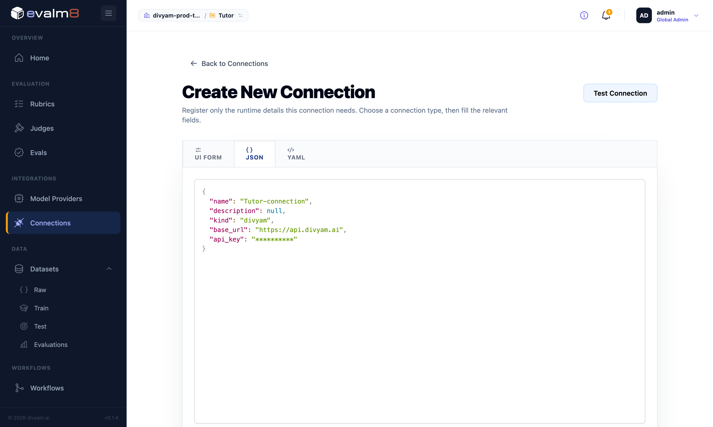

# Divyam Router + evalm8: Route on Quality

**Router** is an OpenAI-compatible gateway. Point your app at it and it picks the best model per request against your cost, latency, and quality targets. No app rewrite, just a base-URL swap.

**evalm8** is where you define what "good" means: rubrics and LLM judges that score model responses. Register an evalm8 eval with the router and those scores become the quality signal that drives model selection.

You drive both from the `divyam` CLI. Full command reference and per-topic guides live in the [divyam CLI wiki](https://github.com/Divyam-AI/divyam-cli/wiki). New to the CLI? Start with [Installation](https://github.com/Divyam-AI/divyam-cli/wiki/Installation).

```text
Your app ──▶ Divyam Router ──▶ chosen model (OpenAI, Gemini, Claude, ...)
                   │
                   └─ scores (sampled) traffic with your evalm8 eval ──▶ dashboards + selectors
```

### Endpoints

| Use | URL |
| --- | --- |
| Router API | `https://api.divyam.ai` |
| evalm8 service | `https://evalm8.divyam.ai` |

---

## Step 1: Onboard and route (drop-in)

> Wiki: [Setup Your Account](https://github.com/Divyam-AI/divyam-cli/wiki/Setup-Your-Account) · [Config](https://github.com/Divyam-AI/divyam-cli/wiki/Config) · [Manage your LLM models](https://github.com/Divyam-AI/divyam-cli/wiki/Manage-your-LLM-models) · [Onboard Your Application](https://github.com/Divyam-AI/divyam-cli/wiki/Onboard-Your-Application-to-Divyam)

```bash
# 1. Create your org and a service account. Save the printed API key, it is shown only once.
divyam org create --name "Acme"
export DIVYAM_ORG_ID=<org-id-from-output>

divyam sa create --name "acme-prod"
export DIVYAM_API_TOKEN=divyam-v1-********        # from output

# 2. Save a reusable CLI config and activate it.
divyam config set -c acme-prod -e https://api.divyam.ai \
  -o $DIVYAM_ORG_ID -s <service-account-id> -t $DIVYAM_API_TOKEN
divyam config use acme-prod

# 3. Register a provider and the model(s) you run today.
divyam model-info create --provider-name openai \
  --provider-base-url https://api.openai.com/v1 \
  --provider-api-key <your-openai-key> \
  --model-names gpt-4o,gpt-4o-mini
```

Point your app at the router (OpenAI SDK):

```python
from openai import OpenAI
client = OpenAI(base_url="https://api.divyam.ai/v1", api_key="divyam-v1-********")
client.chat.completions.create(model="openai:gpt-4o", messages=[...])
```

The router is now a transparent passthrough, returning the same responses as before with full logging. Watch requests arrive in real time on your [dashboards](https://github.com/Divyam-AI/divyam-cli/wiki/Access-your-Dashboards).

**Optional request headers** for analytics and multi-turn evals:

| Header | Purpose |
| --- | --- |
| `x-user-id` | consistent routing and per-user analytics |
| `x-session-id` | required for `SESSION_BASED` evals |
| `x-eval-request-id` | required for `TURN_BASED` evals (agentic flows) |
| `x-flow-id` | tag traffic for analytics |

**Tip:** test any model through the router without touching your app: `divyam chat --model-name openai:gpt-4o`.

---

## Step 2: Build an eval in evalm8

> Best results come from real traffic. Seed the dataset from your router logs, hand-annotate a small sample, then let the judges scale that labeling to the full set.

Example: a **Tutor Eval** scoring tutor answers on Correctness and Understandability.

**a. Rubric** defines the dimensions, scales, and pass threshold.

```json
{
  "name": "Tutor Effectiveness",
  "description": "Correctness and understandability of tutor responses",
  "dimensions": [
    {"name": "Understandability", "scale": {"type": "integer", "min": 1, "max": 5}, "min_passing_score": 2, "weight": 1, "is_inverted": false},
    {"name": "Correctness",       "scale": {"type": "integer", "min": 1, "max": 5}, "min_passing_score": 2, "weight": 1, "is_inverted": false}
  ],
  "passing_score_threshold": 0.7
}
```

> 🖼️ **Screenshot slot:** evalm8 → Rubric builder
> 

**b. Model providers**: add the models you want to test.

> 🖼️ **Screenshot slot:** evalm8 → Model providers
> 

**c. Judges**: one LLM judge per dimension.

```json
{
  "type": "llm",
  "origin": "bespoke",
  "name": "Correctness Judge",
  "inputs": [
    {"name": "query",    "target_type": "string", "description": "The prompt sent to the model."},
    {"name": "response", "target_type": "string", "description": "The model response to evaluate."}
  ],
  "template": "You are an expert evaluator assessing the correctness of a model response to a given query.",
  "mode": {"type": "pointwise", "scale": {"type": "integer", "min": 1, "max": 5}}
}
```

Repeat for the Understandability judge.

> 🖼️ **Screenshot slot:** evalm8 → Judges (Correctness LLM judge: inputs, template, pointwise scale)

**d. Assemble the eval** in the Eval builder: name it (e.g. `Tutor Eval`), select the rubric, and for each dimension wire its judge (set `judge_id`, pick the judge, leave config and pipeline blank).

> 🖼️ **Screenshot slot:** evalm8 → Eval builder (rubric selected, a judge wired per dimension)

**e. Import datasets** under Connectors: import your raw dataset by creating a connection.

> 🖼️ **Screenshot slot:** evalm8 → Connectors
> 

---

## Step 3: Connect the eval to the router

> Wiki: [Manage Evals](https://github.com/Divyam-AI/divyam-cli/wiki/Manage-Evals)

Register the eval on your service account so the router scores traffic with it:

```bash
divyam eval create --name evalm8 --granularity LLM_REQUEST_RESPONSE --state ACTIVE \
  --class-name "divyamlibs.evaluator.strategies.evalm8.evalm8_evaluation_criteria.Evalm8RequestResponseEvaluationCriteria" \
  --class-init-config '{
    "base_url": "https://evalm8.divyam.ai",
    "org": "<your-org>",
    "project": "Tutor",
    "eval_name": "Tutor Eval",
    "eval_ref": "latest",
    "api_key": "<change-me>"
  }'
```

`--class-init-config` fields:

| Field | Meaning |
| --- | --- |
| `base_url` | evalm8 service URL |
| `org` / `project` | your evalm8 workspace and project |
| `eval_name` | the eval you built in Step 2 |
| `eval_ref` | version to use (`latest` or a pinned ref) |
| `api_key` | evalm8 API key |

`--granularity LLM_REQUEST_RESPONSE` scores each request/response pair. Use `TURN_BASED` or `SESSION_BASED` for multi-turn or full-session scoring (see the header requirements in Step 1).

If you run more than one eval, mark the one routing should optimize toward as primary:

```bash
divyam eval update --id <eval-id> --is-primary true
```

Sampled traffic is now scored against your rubric, and scores show up in your [dashboards](https://github.com/Divyam-AI/divyam-cli/wiki/Access-your-Dashboards) as quality trends per model.

> 🖼️ **Screenshot slot:** evalm8 → eval results / scores (per-dimension scores per model)

---

## Step 4: Route on quality

> Wiki: [Setup Model Routing](https://github.com/Divyam-AI/divyam-cli/wiki/Setup-Model-Routing) · [Safely Remove a Model](https://github.com/Divyam-AI/divyam-cli/wiki/Safely-Remove-a-Model)

Use the eval to move to a better or cheaper model, safely.

```bash
# 1. Register the candidate you want to try.
divyam model-info create --provider-name openai \
  --provider-base-url https://api.openai.com/v1 \
  --provider-api-key <key> --model-names gpt-4o-mini

# 2. Create a selector across candidates, scored by your eval.
divyam selector create --name tutor-selector \
  -m "openai:gpt-4o,openai:gpt-4o-mini" \
  -x default --eval-id <eval-id>

# 3. The selector trains and validates in shadow. Promote it when ready.
divyam selector update --id <selector-id> --to-prod
```

Tuning is automated by the selector training workflow. Check the candidate's performance on the [training dashboard](https://github.com/Divyam-AI/divyam-cli/wiki/Access-your-Dashboards), and override the cost/quality trade-off only if needed (`--lambda`, where `0.0` is max quality and `1.0` is max savings):

```bash
# Optional: override the automatic trade-off.
divyam selector update --id <selector-id> --lambda 0.5
```

Roll out gradually by splitting traffic on the service account (percent of traffic kept on the incumbent vs. bypassing the selector):

```bash
divyam sa update --traffic-allocation-config '{"control": 10.0, "selector_disabled": 80.0}'
```

The selector now routes each request to the model that meets your quality bar at the lowest cost. Monitor routing decisions and model split on your [dashboards](https://github.com/Divyam-AI/divyam-cli/wiki/Access-your-Dashboards), while evalm8 keeps scoring live traffic so you can see the impact.

---

## Inspect and manage

```bash
divyam eval ls                          # your registered evals
divyam model-info ls                    # registered providers and models
divyam selector get --id <selector-id>  # selector state (SHADOW, PROD, ...)
```

Retire a selector with `divyam selector update --id <selector-id> --retire`. To pull a model out of rotation cleanly, follow [Safely Remove a Model](https://github.com/Divyam-AI/divyam-cli/wiki/Safely-Remove-a-Model).

---

**The loop:** onboard, route as passthrough, define quality in evalm8, register the eval, then let selectors route on that signal. Repeat as new models ship.

*More detail on any step: [divyam CLI wiki](https://github.com/Divyam-AI/divyam-cli/wiki).*
