# Divyam Router + Evalm8: Route on Quality

This guide walks you through the bare minimum essential steps to use and train
Divyam Router leveraging evals from Divyam Evalm8, to achieve your quality and
cost saving goals.

You drive both from the `divyam` CLI and the Evalm8 web UI. Full
command reference and per-topic
guides live in
the [divyam CLI wiki](https://github.com/Divyam-AI/divyam-cli/wiki). New to the
CLI? Start
with [Installation](https://github.com/Divyam-AI/divyam-cli/wiki/Installation).

```text
Your app ──▶ Divyam Router ──▶ chosen model (OpenAI, Gemini, Claude, ...)
                   │
                   └─ scores (sampled) traffic with your Evalm8 eval ──▶ dashboards + selectors
```

### TL;DR — The Loop

1. **Onboard** — point your app at the router (transparent passthrough).
2. **Define quality** — build a rubric, judges, and an eval in Evalm8.
3. **Connect** — register the eval on your router service account.
4. **Route** — train a selector and let it pick the best model per request.

Repeat as new models ship.

### Keys You'll Need

| Key                | Where you get it                   | Where it's used                                                                                |
|--------------------|------------------------------------|------------------------------------------------------------------------------------------------|
| **Router API key** | `divyam sa create` output (Step 1) | Your app's `api_key` when calling the router; also pasted into the Evalm8 Connection (Step 2e) |
| **Evalm8 API key** | Provisioned by Divyam              | `--class-init-config` when registering the eval on the router (Step 3)                         |

These are two different keys. Do not swap them.

### Endpoints

| Use            | URL                        |
|----------------|----------------------------|
| Router API     | `https://api.divyam.ai`    |
| Evalm8 service | `https://evalm8.divyam.ai` |

---

## Step 1: Onboard and route (drop-in)

### Hosted Divyam

Your organization, user accounts, service accounts, and credentials will be
set up by the Divyam team and provided to you.

### On-prem Divyam deployment

>
Wiki: [Setup Your Account](https://github.com/Divyam-AI/divyam-cli/wiki/Setup-Your-Account) · [Config](https://github.com/Divyam-AI/divyam-cli/wiki/Config) · [Manage your LLM models](https://github.com/Divyam-AI/divyam-cli/wiki/Manage-your-LLM-models) · [Onboard Your Application](https://github.com/Divyam-AI/divyam-cli/wiki/Onboard-Your-Application-to-Divyam)

```bash
# a. Create your org and a service account. Save the printed API key — it is shown only once.
divyam org create --name "Acme"
export DIVYAM_ORG_ID=<org-id-from-output>

divyam sa create --name "acme-prod"
export DIVYAM_API_TOKEN=divyam-v1-********        # from output

# b. Save a reusable CLI config and activate it.
divyam config set -c acme-prod -e https://api.divyam.ai \
  -o $DIVYAM_ORG_ID -s <service-account-id> -t $DIVYAM_API_TOKEN
divyam config use acme-prod

# c. Register a provider and the model(s) you run today.
divyam model-info create --provider-name openai \
  --provider-base-url https://api.openai.com/v1 \
  --provider-api-key <your-openai-key> \
  --model-names gpt-4o,gpt-4o-mini
```

Point your app at the router (OpenAI SDK):

```python
from openai import OpenAI
client = OpenAI(base_url="https://api.divyam.ai/v1", api_key="divyam-v1-********")
client.chat.completions.create(model="openai:gpt-4o", messages=[...])
```

The router is now a transparent passthrough, returning the same responses as
before with full logging. Watch requests arrive in real time on
your [dashboards](https://github.com/Divyam-AI/divyam-cli/wiki/Access-your-Dashboards).

Set your baseline traffic split so the router logs traffic for later selector
training: a small held-out `control` baseline (never used for training) and the
rest routed with your default model (`selector_disabled`). The percentages are
your call.

```bash
divyam sa update --traffic-allocation-config '{"control": 10.0, "selector_disabled": 90.0}'
```

**Optional request headers** for analytics and multi-turn evals:

| Header              | Purpose                                         |
|---------------------|-------------------------------------------------|
| `x-user-id`         | consistent routing and per-user analytics       |
| `x-session-id`      | required for `SESSION_BASED` evals              |
| `x-eval-request-id` | required for `TURN_BASED` evals (agentic flows) |
| `x-flow-id`         | tag traffic for analytics                       |

**Tip:** test any model through the router without touching your app:
`divyam chat --model-name openai:gpt-4o`.

---

## Step 2: Build an eval in Evalm8

**Access first:** Divyam provisions the service accounts and API keys you
need — one for the router and one for Evalm8 — or ask your Divyam installation
administrators for these. Your account must be added to the org with the
**Evaluator** project role (Settings → Project Roles).
Then sign in to Evalm8 (`https://evalm8.divyam.ai`) and switch to your project.

The eval is built in the following sub-steps:

- **(2a–2d) Define** the evaluation criteria (rubric) and create seed judges.
- **(2e–2f) Raw dataset** — pull router traces to serve as the raw dataset
  without
  any annotations.
- **(2g) Golden dataset** — sample traces and collect human annotations from
  your
  domain experts.
- **(2h) Refine** — refine the judges to better align with the human-annotated
  golden dataset.

If your judges are good enough out of the box, you can skip sub-steps 2e
through 2h and jump straight to Step 3.

The example used throughout: a **Tutor Eval** scoring tutor answers on
Correctness and Understandability.

> **Note:** this guide covers single-turn (`LLM_REQUEST_RESPONSE`) evals only.
> For multi-turn or session-based evals see the
> [divyam CLI wiki](https://github.com/Divyam-AI/divyam-cli/wiki).

### 2a. Rubric

*Evaluation → Rubrics.* Sets the dimensions, scales, and pass threshold.

<details><summary>Rubric definition (JSON)</summary>

```json
{
  "name": "Tutor Effectiveness",
  "description": "Correctness and understandability of tutor responses",
  "dimensions": [
    {
      "name": "Understandability",
      "scale": {
        "type": "integer",
        "min": 1,
        "max": 5
      },
      "min_passing_score": 2,
      "weight": 1,
      "is_inverted": false
    },
    {
      "name": "Correctness",
      "scale": {
        "type": "integer",
        "min": 1,
        "max": 5
      },
      "min_passing_score": 2,
      "weight": 1,
      "is_inverted": false
    }
  ],
  "passing_score_threshold": 0.7
}
```

</details>

<details><summary>🖼️ Evalm8 → Rubric builder</summary>

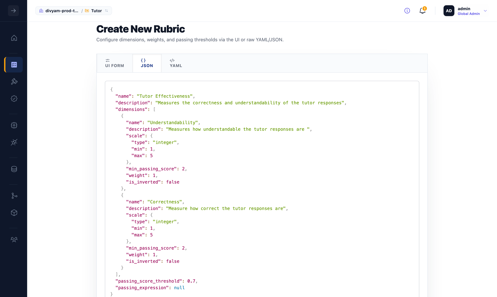

</details>

### 2b. Model providers

*Integrations → Model Providers.* Add the models the judges and your candidates
run on.

<details><summary>🖼️ Evalm8 → Model providers</summary>

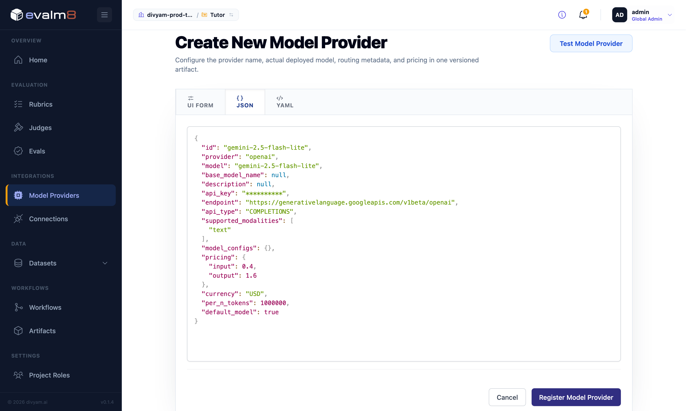

</details>

### 2c. Judges

*Evaluation → Judges.* One LLM judge per dimension. The judge name becomes its
slug ID (`Correctness JUDGE` becomes `correctness-judge`), which the eval
references. Use origin `bespoke` for a fixed prompt, or `fine_tuned` so the
judge learns from your golden dataset over time. The template holds the 1-to-5
scoring guide and reads `{{query}}` and `{{response}}`.

<details><summary>Judge definition (JSON)</summary>

```json
{
  "type": "llm",
  "origin": "fine_tuned",
  "name": "Correctness JUDGE",
  "inputs": [
    {
      "name": "query",
      "target_type": "string",
      "description": "The prompt sent to the model."
    },
    {
      "name": "response",
      "target_type": "string",
      "description": "The model response to evaluate."
    }
  ],
  "template": "You are an expert evaluator assessing the correctness of a model response. Score 1 to 5, then explain briefly. Query: {{query}} Response: {{response}}",
  "mode": {
    "type": "pointwise",
    "scale": {
      "type": "integer",
      "min": 1,
      "max": 5
    }
  }
}
```

</details>

<details><summary>🖼️ Evalm8 → Judge builder</summary>

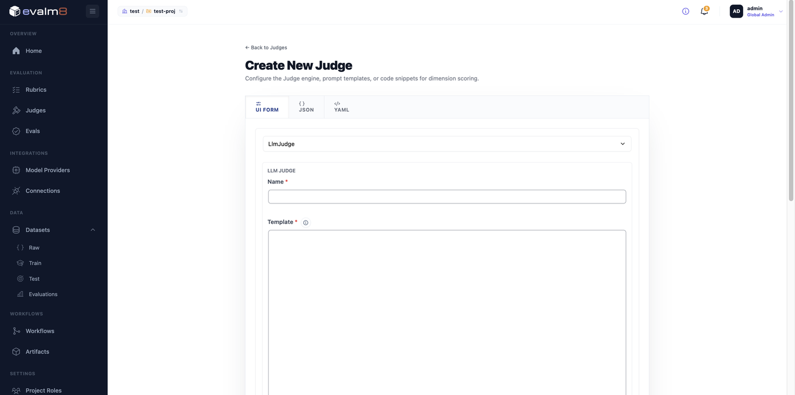

</details>

### 2d. Eval

*Evaluation → Evals.* Name it, select the rubric, and for each dimension click
Configure Judge, set `judge_id` to the judge slug, and paste the pipeline. The
pipeline runs per trace: pick the last LLM span, guard against missing spans,
extract `query` and `response` from `llm.input_messages` and
`llm.output_messages`, then call the judge for a 1-to-5 score. No ground-truth
field is needed, so it works on raw production traces.

If your traces have llm calls and need evaluation only at a query, response
level, you do not need any custom pipeline.

Below is an example pipeline that added some guard and extraction steps before
evaluation.

<details><summary>Eval pipeline (JSON, abbreviated)</summary>

```json
{
  "steps": [
    {
      "id": "correctness_prompt_prefix",
      "type": "static",
      "result": "You are an expert evaluator assessing correctness..."
    },
    {
      "id": "llm_span",
      "type": "select",
      "selector": {
        "type": "cel",
        "expression": "[last(sortByKey(trace.spans.filter(s, s[\"openinference.span.kind\"] == \"LLM\"), \"end_time\"))[\"span_id\"]]"
      }
    },
    {
      "id": "guard_llm_span",
      "type": "guard",
      "condition": {
        "type": "cel",
        "condition": "size(trace.spans) > 0"
      },
      "on_fail": {
        "result": {
          "reason": "No LLM span found.",
          "score": 1
        }
      }
    },
    {
      "id": "extracted_inputs",
      "type": "extract",
      "resolver": {
        "type": "cel",
        "mapping": {
          "query": "trace.spans[0].attributes[\"llm.input_messages\"][0][\"message.content\"]",
          "response": "trace.spans[0].attributes[\"llm.output_messages\"][0][\"message.content\"]"
        }
      }
    },
    {
      "id": "correctness_score",
      "type": "call",
      "judge_id": "correctness-judge",
      "input_mapping": {
        "query": {
          "type": "declarative",
          "value": "extracted_inputs.query"
        },
        "response": {
          "type": "declarative",
          "value": "extracted_inputs.response"
        }
      }
    }
  ]
}
```

The Understandability pipeline is identical except `judge_id` is
`understandability-judge`.

</details>

<details><summary>🖼️ Evalm8 → Eval builder</summary>

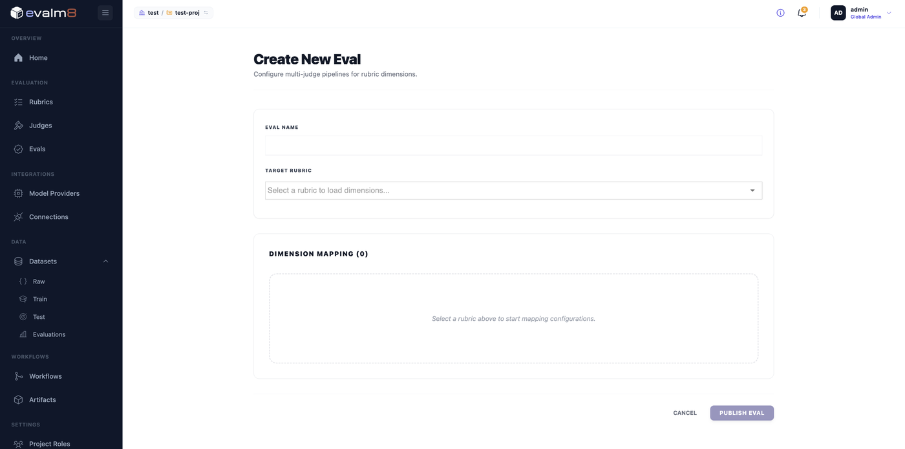

</details>

### 2e. Connection to the router

Register a **Connection** so Evalm8 can pull traces from your router.

*Integrations → Connections → Create New Connection.* Pick **DivyamConnection**,
set the Base URL, paste your **router** service account API key, click Test
Connection, then Register.

<details><summary>🖼️ Evalm8 → Create Connection</summary>

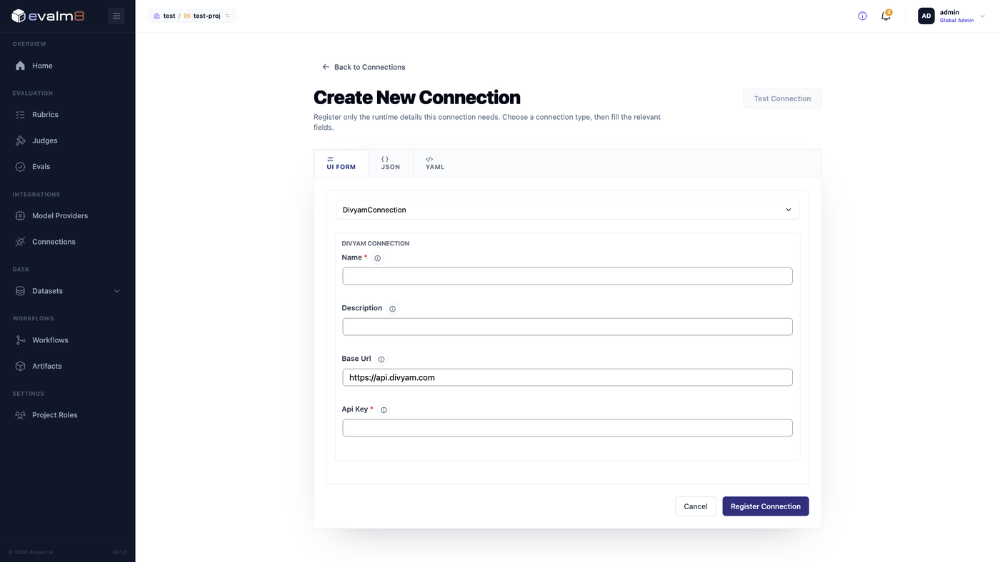

</details>

### 2f. Raw dataset from router traces

Use the **Create Raw Dataset** workflow to pull router traces into Evalm8.

*Workflows → Create Raw Dataset.* Pick the connection and run.

<details><summary>🖼️ Evalm8 → Workflows → Create Raw Dataset</summary>

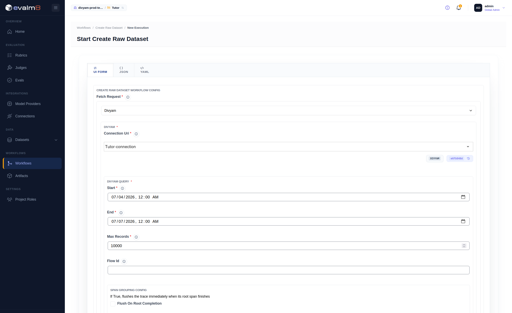

</details>

On successful completion you should see the raw dataset under
*Evalm8 → Datasets → Raw*.

<details><summary>The dataset looks something like this</summary>

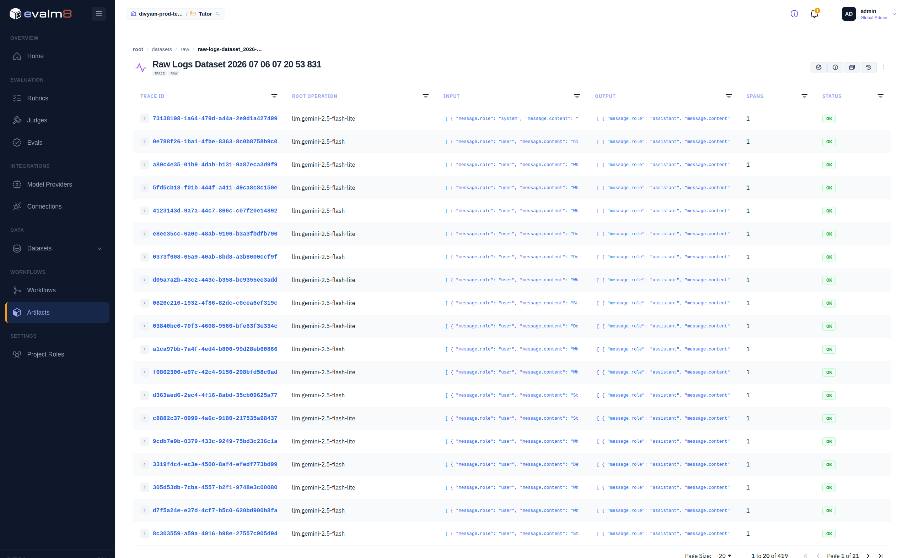

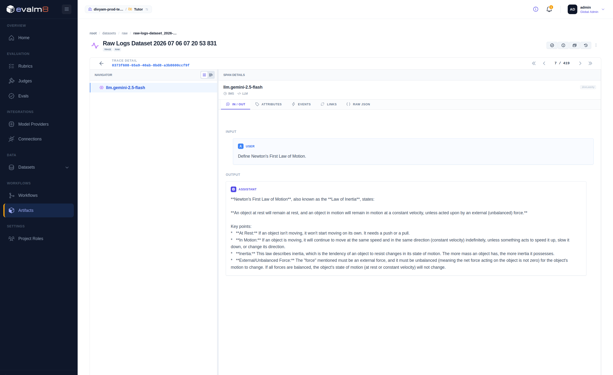

</details>

**Smoke test (optional).** To set a baseline for your seed judges, run
evaluation on the raw dataset: *Workflows → Evaluate Dataset*, pick the eval and
the raw dataset, then Run. It scores every trace 1 to 5 (aggregate normalised
0 to 1) with judge reasoning, visible in the Evaluations tab.

<details><summary>🖼️ Evalm8 → Evaluate Dataset (running)</summary>

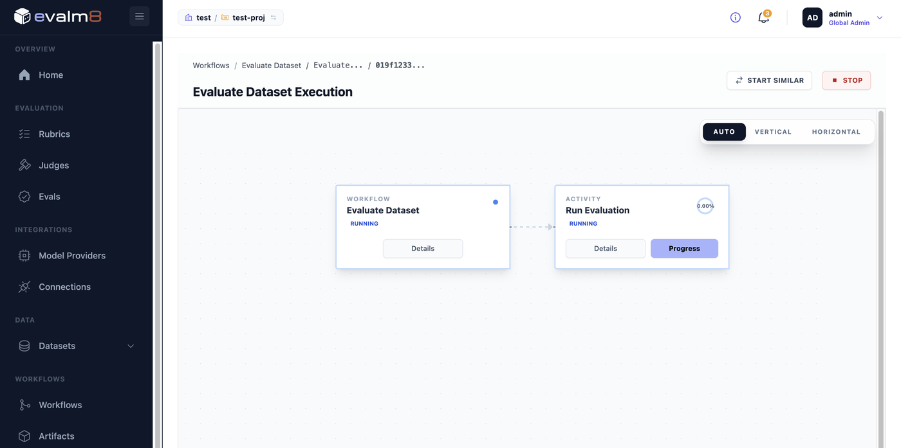

</details>

<details><summary>What the normalised scores mean</summary>

| Displayed | Raw | Meaning                                                                                                |
|-----------|-----|--------------------------------------------------------------------------------------------------------|
| 0.00      | n/a | Pipeline guard exited before the judge (usually missing `llm.input_messages` or `llm.output_messages`) |
| 0.25      | 1   | Completely incorrect or incomprehensible                                                               |
| 0.50      | 2   | Mostly incorrect or mostly unclear                                                                     |
| 0.75      | 3   | Partially correct or partially clear                                                                   |
| 0.88      | 4   | Mostly correct or mostly clear                                                                         |
| 1.00      | 5   | Perfectly correct or exceptionally clear                                                               |

</details>

### 2g. Golden dataset (human annotation)

**2g-i. Create the golden dataset.** *Workflows → Create Eval Golden Dataset.*
Pick the eval and raw dataset, then Run. It samples traces, creates an
annotation task, and pauses at **Await Data Annotation** for human reviewers.

<details><summary>🖼️ Evalm8 → Create Eval Golden Dataset (completed)</summary>

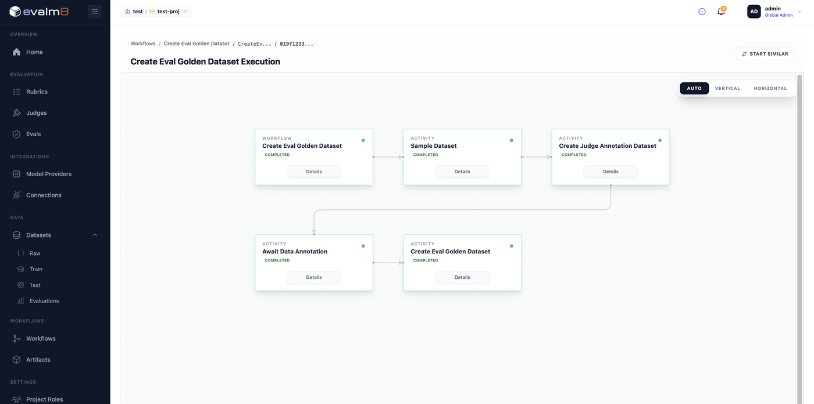

</details>

**2g-ii. Annotate in Argilla.** Each record shows the `query`, the `response`,
and the judge's pre-scored suggestion as a starting point. Enter your own score
(1 to 5) and reasoning, then **Submit** each record (drafts do not advance the
workflow). Submitted labels become the train and test splits.

<details><summary>🖼️ Argilla → annotation task</summary>

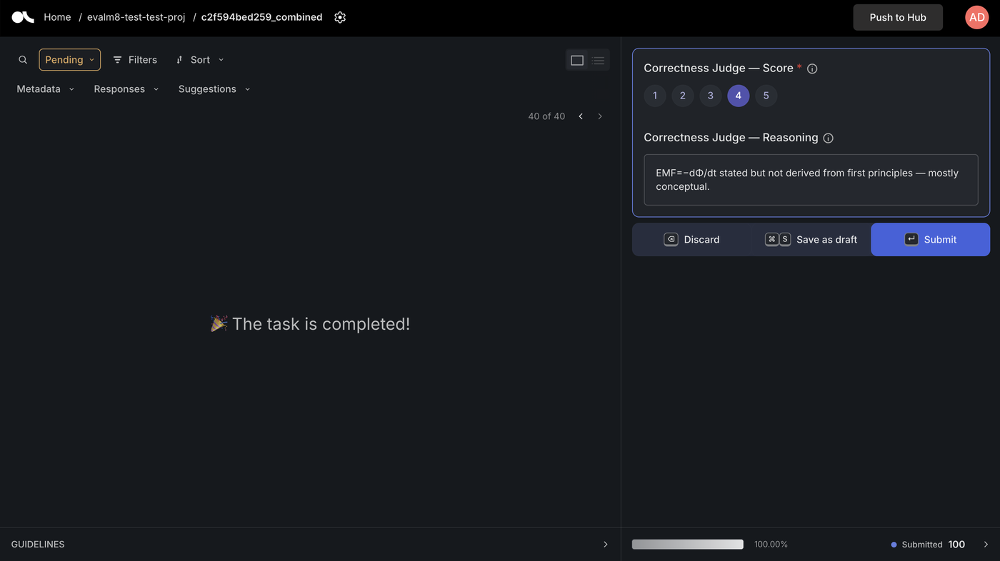

</details>

### 2h. Refine eval

*Workflows → Refine Eval.* Refines existing judges and creates a `fine_tuned`
judge on the golden train and test splits, so automated scores track human
judgment more closely each cycle. Repeat sub-steps 2f and 2g as you gather
more labels. The refinement algorithms parameter can be tuned to control the
evaluation budget (in terms of LLM calls).

<details><summary>🖼️ Start refine eval workflow</summary>

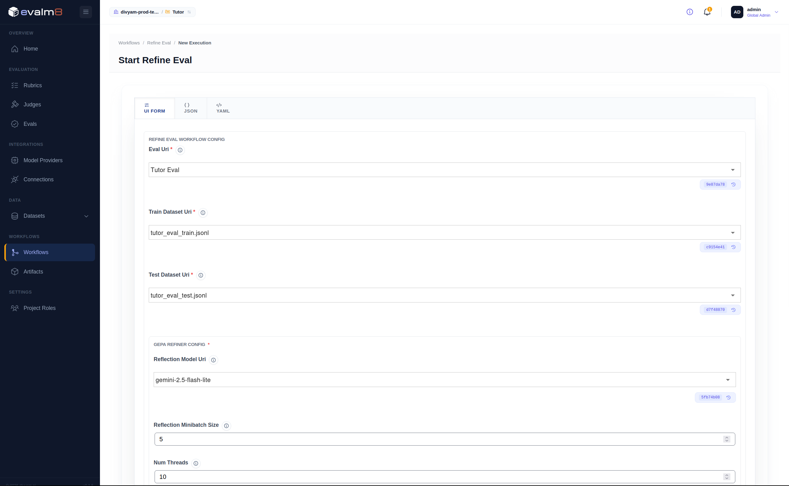

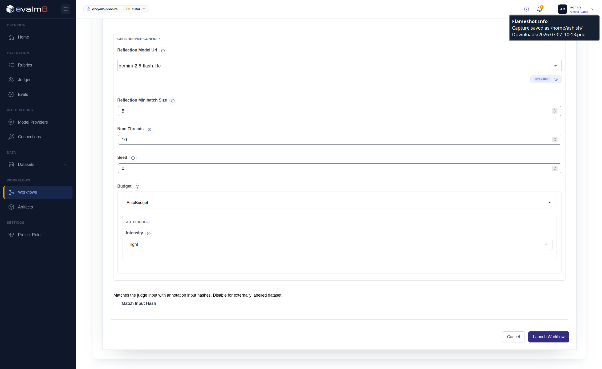

</details>

The workflow will take time to complete. Once refinement is done, review the
results. If you see enough improvement in performance, approve the new eval and
judges, then use the refined eval for evaluation and router training.

<details><summary>🖼️ Review refinement</summary>

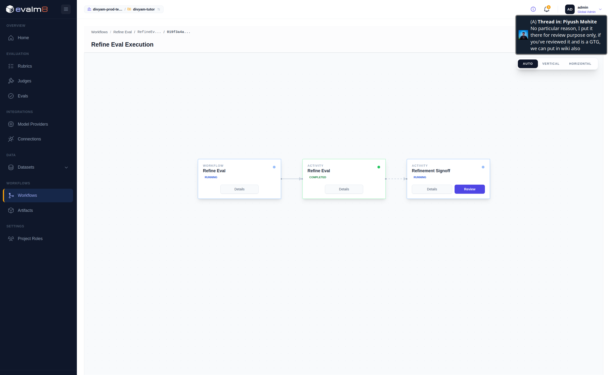

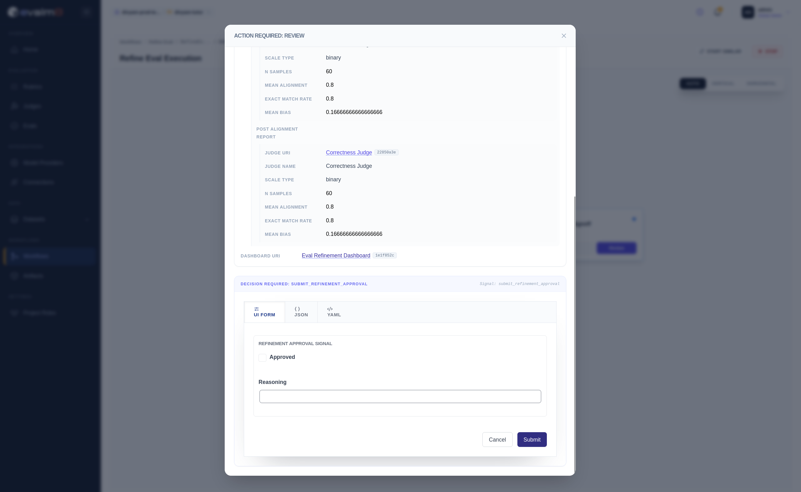

</details>

Once approved, the refined eval replaces the existing eval.

<details><summary>🖼️ Eval replace</summary>

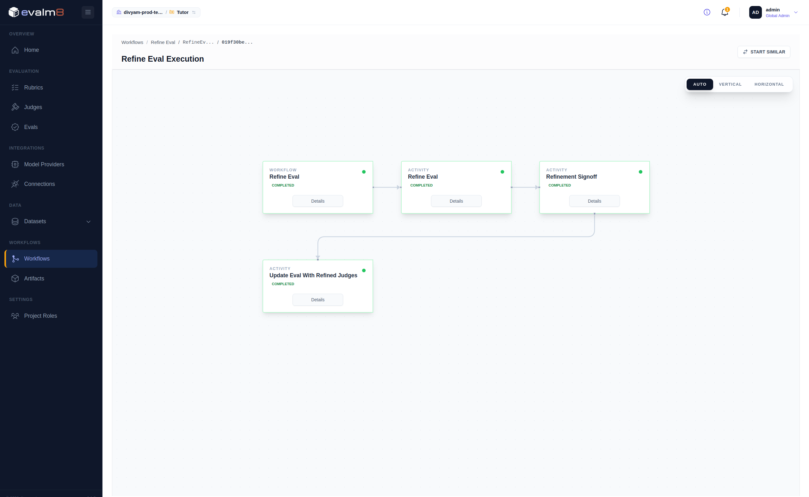


</details>

The older eval and all objects are maintained under version control and can be
inspected or restored. The lineage of every object is also maintained for
provenance.

<details><summary>🖼️ Eval version control</summary>

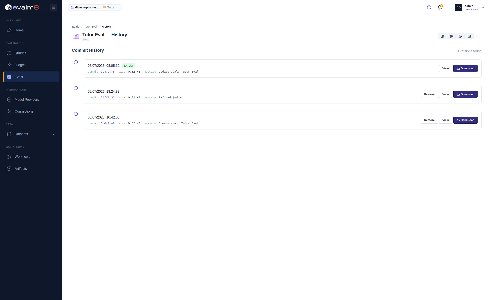

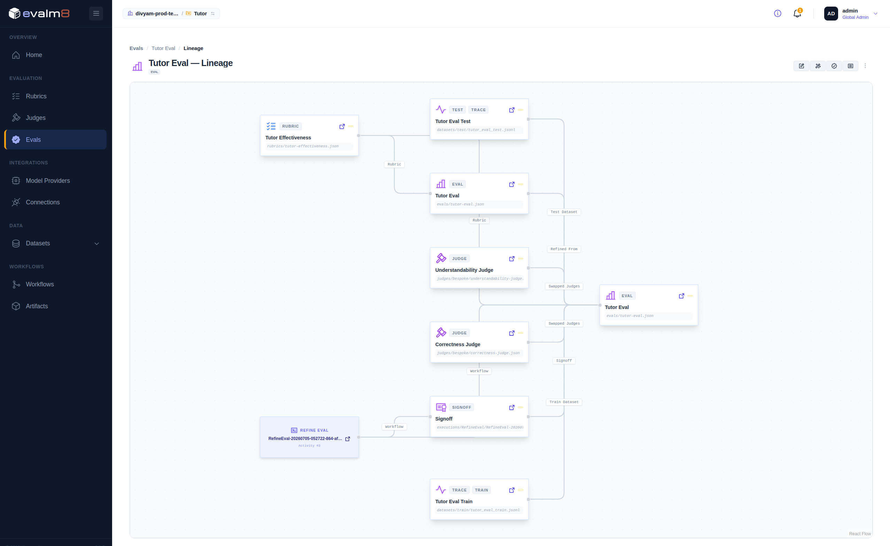

</details>

<details><summary>Common issues</summary>

| Symptom                                   | Fix                                                                                                  |
|-------------------------------------------|------------------------------------------------------------------------------------------------------|
| All traces score 0.00 or 1                | Pipeline guard is failing. Confirm `llm.input_messages` and `llm.output_messages` exist in the span. |
| `JudgeNotFound` in a trace                | `judge_id` must match the judge slug exactly (`correctness-judge`, not `correctness`).               |
| Annotation count stuck                    | Records must be **Submitted** in Argilla, not saved as draft.                                        |
| `No trainable LLM judges found` on Refine | Run Evaluate Dataset first, and use a `fine_tuned` judge with completed golden splits.               |

</details>

---

## Step 3: Connect the eval to the router

>
Wiki: [Manage Evals](https://github.com/Divyam-AI/divyam-cli/wiki/Manage-Evals)

Register the eval on your service account so the router scores traffic with it.
Eval scoring is asynchronous — it does not add latency to the request path.

```bash
divyam eval create --name "Tutor Eval" --granularity LLM_REQUEST_RESPONSE --state ACTIVE \
  --class-name "divyamlibs.evaluator.strategies.Evalm8.evalm8_evaluation_criteria.Evalm8RequestResponseEvaluationCriteria" \
  --class-init-config '{
    "base_url": "https://evalm8.divyam.ai",
    "org": "<your-org>",
    "project": "Tutor",
    "eval_name": "Tutor Eval",
    "eval_ref": "latest",
    "api_key": "<evalm8-api-key>"
  }'
```

> The `--class-name` is the fully-qualified evaluator class. This is currently
> the only supported value for Evalm8 request/response evals; there is no short
> alias.

<details><summary>Field reference: <code>--class-init-config</code></summary>

| Field             | Meaning                                                                                      |
|-------------------|----------------------------------------------------------------------------------------------|
| `base_url`        | Evalm8 service URL                                                                           |
| `org` / `project` | your Evalm8 workspace and project                                                            |
| `eval_name`       | the eval you built in Step 2                                                                 |
| `eval_ref`        | version to use (`latest` or a pinned ref)                                                    |
| `api_key`         | Evalm8 service account API key from Divyam (not the router key used in Step 2e's Connection) |

</details>

`--granularity LLM_REQUEST_RESPONSE` scores each request/response pair. Use
`TURN_BASED` or `SESSION_BASED` for multi-turn or full-session scoring (see the
header requirements in Step 1).

If you run more than one eval, mark the one routing should optimize toward as
primary:

```bash
divyam eval update --id <eval-id> --is-primary true
```

Sampled traffic is now scored against your rubric, and scores show up in
your [dashboards](https://github.com/Divyam-AI/divyam-cli/wiki/Access-your-Dashboards)
as quality trends per model.

---

## Step 4: Route on quality

>
Wiki: [Setup Model Routing](https://github.com/Divyam-AI/divyam-cli/wiki/Setup-Model-Routing) · [Safely Remove a Model](https://github.com/Divyam-AI/divyam-cli/wiki/Safely-Remove-a-Model)

Once the eval is live, use it to move to a better or cheaper model without
guesswork. Routing is driven by a **selector**: a policy trained on your traffic
and scored by your eval, which the router serves only after you promote it.

**Prerequisites:** the eval from Step 3, at least two candidate models
registered, and traffic already flowing from Step 1.

The selector moves through three states:

```text
TRAINED ──▶ SHADOW (staged, not served) ──▶ PROD (serving live traffic)
```

At any point `divyam selector get` shows its state, and a stage that breaks
surfaces as `FAILED`.

**4a. Register the candidate model** you want to try against your current one.

```bash
divyam model-info create --provider-name openai \
  --provider-base-url https://api.openai.com/v1 \
  --provider-api-key <key> --model-names gpt-4o-mini
```

**4b. Create the selector** across the candidates, linked to your eval. Training
starts automatically on the traffic already logged from Step 1 (the `control`
baseline is held out).

```bash
divyam selector create --name tutor-selector \
  -m "openai:gpt-4o,openai:gpt-4o-mini" \
  -x message_history --eval-id <eval-id>
export DIVYAM_SELECTOR=<selector-id>
```

The `-x` flag sets the feature extraction strategy (here, `message_history`
extracts features from the conversation). Use `-c <config.yaml>` instead for
full control — see the wiki's `sample-selector-config.yaml`.

**4c. Wait for shadow.** Training runs through its stages to `TRAINED` and then
advances to `SHADOW` on its own, where the selector is validated against your
traffic but does not serve live requests. Track progress on
the [training dashboard](https://github.com/Divyam-AI/divyam-cli/wiki/Access-your-Dashboards)
and check the state:

```bash
divyam selector get --id $DIVYAM_SELECTOR   # state: SHADOW when ready (FAILED if a stage broke)
```

**4d. Promote shadow to production.** Only a `SHADOW` selector can be promoted.

```bash
divyam selector update --id $DIVYAM_SELECTOR --to-prod
```

**4e. Ramp its traffic share.** Now that it is `PROD`, raise the selector's
share
of the split and lower `selector_disabled`. The percentages are your call: for
example, route most traffic through the selector while keeping a `control`
baseline to measure against. Monitor routing and the model split on
your [dashboards](https://github.com/Divyam-AI/divyam-cli/wiki/Access-your-Dashboards).

```bash
divyam sa update --traffic-allocation-config \
  '{"'"$DIVYAM_SELECTOR"'": 80.0, "selector_disabled": 10.0, "control": 10.0}'
```

Evalm8 keeps scoring live traffic throughout, so you see the quality and cost
impact as you ramp.

---

## Inspect and manage

```bash
divyam eval ls                              # your registered evals
divyam model-info ls                        # registered providers and models
divyam selector get --id $DIVYAM_SELECTOR   # state: TRAINED, SHADOW, PROD, INACTIVE, ...
```

Retire a selector with `divyam selector update --id $DIVYAM_SELECTOR --retire`.
To pull a model out of rotation cleanly,
follow [Safely Remove a Model](https://github.com/Divyam-AI/divyam-cli/wiki/Safely-Remove-a-Model).

---

**The loop:** onboard → route as passthrough → define quality in Evalm8 →
register
the eval → let selectors route on that signal. Repeat as new models ship.

*More detail on any
step: [divyam CLI wiki](https://github.com/Divyam-AI/divyam-cli/wiki).*